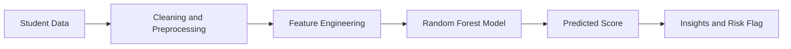

# Student Performance Prediction System

An industry-oriented data science and machine learning project that predicts student academic performance from study habits, attendance, support systems, and learning behavior. This version uses synthetic data so it can be built without access to private school or college records.

## 1. Project Explanation

### What is Student Performance Prediction?
Student performance prediction is the process of using historical or simulated student data to estimate academic outcomes such as exam score, pass/fail status, or performance band. In this project, the model predicts a final score from behavioral and academic signals.

### Why it is important
Educational outcomes are influenced by multiple factors, not just marks. A prediction system helps institutions detect risk early, allocate support where needed, and improve learning outcomes before a student fails or drops out.

### How schools, colleges, and EdTech companies use it
This kind of system can be used for:

- identifying weak students early
- improving academic performance with timely intervention
- personalizing learning plans
- preventing dropout by spotting risk patterns

### Simple explanation
If a student studies more, attends classes regularly, completes assignments, and has lower stress, they usually perform better. The system learns that relationship from data and predicts future performance.

### Technical explanation
The system treats student attributes as input features, cleans and transforms them, trains a machine learning model on synthetic historical patterns, and predicts a continuous score. The final prediction can also be converted into a risk band like `Safe` or `At Risk`.

### Workflow
Student data -> preprocessing -> model training -> prediction -> insights

## 2. Tech Stack Options

### Option A: Easy
- Tools: Python, pandas, NumPy, scikit-learn, matplotlib
- Model: Linear Regression or Decision Tree Regression
- Difficulty: Easy
- Best for: Quick college submission, very beginner-friendly

### Option B: Intermediate
- Tools: Python, pandas, NumPy, scikit-learn, seaborn, joblib
- Model: Random Forest Regressor with preprocessing pipeline
- Difficulty: Medium
- Best for: Strong placement project with good accuracy and explainability

### Option C: Advanced
- Tools: Python, scikit-learn, XGBoost/LightGBM, Streamlit, Plotly, joblib
- Model: Gradient boosting ensemble with a dashboard
- Difficulty: High
- Best for: Portfolio-grade project with deployment and rich UI

### Selected best option
Option B is the best balance for a student project. It is strong enough for internships and placements, but still simple enough to understand and explain in interviews.

## 3. Project Architecture

### Input
Student data such as:
- study hours
- attendance
- previous score
- sleep hours
- assignments completed
- participation
- parental support
- internet access
- stress level

### Processing
- missing value handling
- categorical encoding
- feature scaling for numeric variables
- train-test split

### Model
Random Forest Regressor

### Output
- predicted final score
- performance band
- risk flag for weak students

### Data flow diagram


## 4. Implementation Plan

### Phase 1: Setup
Create folders, install dependencies, and prepare the Python environment.

### Phase 2: Data
Generate synthetic student records with realistic patterns and correlations.

### Phase 3: Cleaning
Remove duplicates and let the pipeline impute missing values.

### Phase 4: EDA
Visualize score distribution, correlations, and performance bands.

### Phase 5: Feature Engineering
Use categorical variables, numeric variables, and preprocessing pipelines.

### Phase 6: Model
Train a Random Forest Regressor.

### Phase 7: Evaluation
Measure MAE, MSE, RMSE, and R2.

### Phase 8: Prediction
Predict on unseen student records and classify risk.

### Phase 9: Visualization
Save charts for analysis and GitHub proof.

### Phase 10: GitHub
Push code, README, outputs, and screenshots to GitHub.

## 5. Folder Structure

```text
Student-Performance-Prediction/
│
├── data/
├── notebooks/
├── src/
├── models/
├── outputs/
├── images/
├── README.md
├── requirements.txt
└── main.py
```

## 6. Installation Guide

### Step 1: Clone or open the project folder
Open the `StudentPerformancePredictionSystem` directory in VS Code.

### Step 2: Create a virtual environment
```bash
python -m venv .venv
```

### Step 3: Activate it
On Windows PowerShell:
```bash
.venv\Scripts\Activate.ps1
```

### Step 4: Install dependencies
```bash
pip install -r requirements.txt
```

## 7. Full Code

The project code is split into:
- `main.py` for execution
- `src/data_generation.py` for synthetic data creation
- `src/modeling.py` for preprocessing, training, evaluation, and prediction
- `src/visualization.py` for plots

## 8. Virtual Simulation

### How student data is simulated
The generator creates student records with realistic distributions. For example, study hours are skewed toward lower values, attendance is centered around a high average, and stress lowers predicted performance.

### How performance is predicted
The system learns the relationship between student behavior and final scores from synthetic data. Once trained, it predicts the score of a new student record and can flag the student as `At Risk` if the score is below 50.

## 9. Run Project

### Backend pipeline
```bash
python main.py
```

You can generate a larger dataset with:
```bash
python main.py --samples 5000 --seed 123
```

### Frontend dashboard
```bash
streamlit run app.py
```

This opens a modern interactive UI in your browser where you can adjust student features and see the predicted score instantly.

## 10. GitHub Setup

### Repository name
Use a clean name like `student-performance-prediction-system`.

### Suggested commit flow
1. Add project scaffold and synthetic data pipeline.
2. Add model training and evaluation.
3. Add plots, outputs, and final documentation.

### What to push
- source code
- README
- requirements file
- sample outputs and plots
- saved model file if size is manageable

## 11. README Purpose

This README is already written to act as a portfolio-ready project summary. It explains the problem, approach, architecture, setup, and execution.

## 12. Proof Strategy

### Day 1
- set up project structure
- generate synthetic data

### Day 2
- train the model
- save metrics and plots

### Day 3
- improve visuals and documentation
- push the repository to GitHub

### Day 4
- add interview notes and screenshots
- refine README and project story

## 13. Screenshots to Capture

Include these outputs in GitHub or your portfolio:
- dataset sample table
- final score distribution chart
- correlation heatmap
- actual vs predicted chart
- residual distribution chart
- metrics summary
- demo prediction result

## Expected Interview Talking Points

- why synthetic data was used
- how the synthetic generator was designed
- why Random Forest was selected
- how preprocessing improves reliability
- how the system can be extended to real-world school data

## Files Generated After Running

- `data/student_performance_synthetic.csv`
- `models/student_performance_model.joblib`
- `outputs/metrics.json`
- `outputs/sample_predictions.csv`
- `outputs/run_summary.txt`
- charts inside `images/`

## Next Improvements

- add a Streamlit dashboard
- add explainability with SHAP
- add classification for dropout risk
- deploy the model to a web app or API
